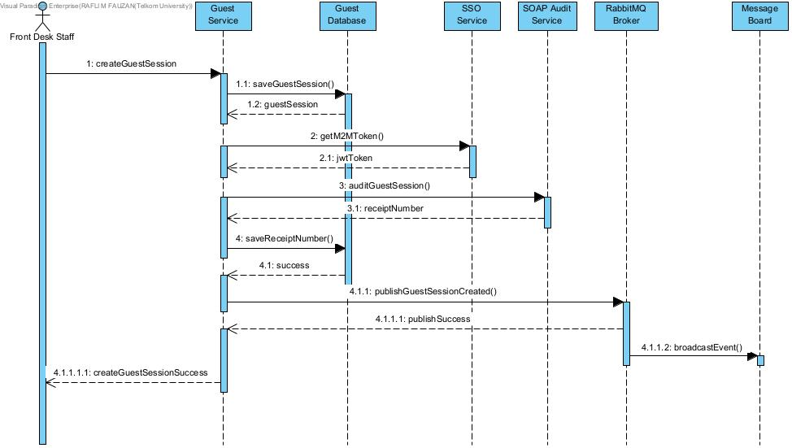

# ANALISIS TUGAS 3 – INTEGRASI LAYANAN TAMU (GUEST SERVICE)

## Identitas

* Nama: Rafli M Fauzan
* NIM: 102022400318
* Kelas: SI4808
* Service: Layanan Tamu (Guest Service)
* Repository: layanan-tamu-guest

---

# 1. Justifikasi Transaksi Kritis

Transaksi kritis yang dipilih pada Guest Service adalah **pembuatan sesi tamu aktif (Guest Session Created)**.

Transaksi ini dipilih karena merupakan titik akhir dari proses check-in tamu pada sistem Smart Hospitality. Setelah reservasi diverifikasi dan kamar ditetapkan, sistem harus membuat sesi tamu aktif yang akan menjadi dasar seluruh layanan hotel selama masa menginap.

Apabila transaksi ini gagal, maka tamu tidak dapat menggunakan layanan hotel meskipun reservasi dan penetapan kamar telah berhasil dilakukan. Oleh karena itu transaksi ini dikategorikan sebagai transaksi yang mengubah status bisnis (state-changing transaction) dan perlu dicatat ke sistem audit terpusat menggunakan SOAP serta disebarkan ke sistem lain menggunakan RabbitMQ.

## Skema Role Lokal

Pada Guest Service digunakan role lokal berikut:

### Front Desk Staff

Tanggung jawab:

* Melakukan proses check-in tamu.
* Memastikan reservasi telah tervalidasi.
* Memicu pembuatan Guest Session setelah kamar ditetapkan.

Hak akses:

* Membuat sesi tamu baru (POST /api/v1/guest-sessions).
* Melihat data sesi tamu (GET).
* Memperbarui informasi sesi tamu (PUT).

Role ini dipilih karena merupakan aktor utama yang berinteraksi langsung dengan proses penerimaan tamu pada sistem Smart Hospitality.

---

# 2. Sequence Diagram Internal



Alur Interaksi Layanan:

1. Front Desk Staff membuat Guest Session melalui Guest Service.
2. Guest Service menyimpan data sesi tamu ke database.
3. Database mengembalikan data Guest Session yang berhasil dibuat.
4. Guest Service meminta JWT Machine-to-Machine (M2M) ke SSO Dosen.
5. SSO Dosen mengembalikan JWT Token.
6. Guest Service mengirim data transaksi Guest Session ke SOAP Audit Service.
7. SOAP Audit Service mengembalikan Receipt Number sebagai bukti audit berhasil.
8. Guest Service menyimpan Receipt Number ke database.
9. Guest Service mempublikasikan event `guest.session.created` ke RabbitMQ.
10. RabbitMQ menerima dan memproses event yang dikirim.
11. Event ditampilkan pada Message Board sebagai bukti publish berhasil.
12. Guest Service mengembalikan response sukses kepada Front Desk Staff.


---

# 3. Implementasi Federated SSO

Guest Service menggunakan mekanisme Machine-to-Machine Authentication yang disediakan oleh Cloud Dosen.

Proses yang dilakukan:

* Mengirim API Key ke endpoint token Cloud Dosen.
* Cloud Dosen mengembalikan JWT Token bertipe m2m.
* Token digunakan untuk mengakses layanan SOAP Audit dan RabbitMQ Publisher.

Endpoint yang digunakan:

```text
POST /api/v1/auth/token
```

Hasil implementasi menunjukkan aplikasi berhasil memperoleh JWT M2M dan menggunakannya untuk mengakses layanan terpusat.

---

# 4. Implementasi SOAP XML Client

Guest Service melakukan transformasi data transaksi dari format JSON menjadi format SOAP XML sesuai kontrak layanan audit yang disediakan dosen.

Data yang diaudit meliputi:

* Guest Session ID
* Nama Tamu
* Nomor Kamar
* Status Sesi
* Waktu Check-In

Setelah SOAP Request berhasil dikirim, sistem menerima Receipt Number seperti:

```text
IAE-LOG-2026-99CF1C0A
```

Receipt Number kemudian disimpan pada kolom:

```text
receipt_number
```

di tabel guest_sessions sebagai bukti transaksi telah tercatat pada sistem audit.

---

# 5. Implementasi RabbitMQ Publisher

Setelah sesi tamu berhasil dibuat, Guest Service mengirim event bisnis ke RabbitMQ.

Nama event:

```text
guest.session.created
```

Contoh payload:

```json
{
  "event": "guest.session.created",
  "team_id": "TEAM-11",
  "data": {
    "guest_session_id": 5,
    "guest_name": "Ricad",
    "room_number": "501",
    "status": "active"
  }
}
```

Event berhasil diterima oleh RabbitMQ dan muncul pada Message Board Cloud Dosen.

---

# 6. Hasil Pengujian

## Pengujian SSO

Hasil:

```text
Berhasil memperoleh JWT M2M
```

Status:

```text
SUCCESS
```

---

## Pengujian SOAP Audit

Hasil:

```text
Receipt Number diterima
```

Contoh:

```text
IAE-LOG-2026-99CF1C0A
```

Status:

```text
SUCCESS
```

---

## Pengujian RabbitMQ

Hasil:

```text
Event guest.session.created berhasil dipublish
```

Status:

```text
SUCCESS
```

---

# 7. Kesimpulan

Guest Service berhasil diintegrasikan dengan infrastruktur terpusat yang disediakan dosen melalui tiga lapisan utama:

1. Federated SSO menggunakan JWT M2M.
2. Legacy SOAP Audit Service untuk pencatatan transaksi kritis.
3. RabbitMQ Message Broker untuk penyebaran event bisnis.

Seluruh pengujian menunjukkan hasil berhasil tanpa error. Data transaksi berhasil dicatat ke sistem audit dan event bisnis berhasil dipublikasikan ke Message Broker sehingga memenuhi kebutuhan integrasi pada Tugas 3.

# 8. Capaian Teknis

## Modul 1 - Federated SSO

Status: BERHASIL

Implementasi:
- Menggunakan Machine-to-Machine Authentication (M2M).
- Mengirim API Key ke Cloud Dosen.
- Menerima JWT Token.
- JWT digunakan untuk mengakses layanan terpusat.

Bukti:
- JWT berhasil diterima dari endpoint /api/v1/auth/token.

---

## Modul 2 - SOAP XML Client

Status: BERHASIL

Implementasi:
- Data transaksi Guest Session ditransformasikan ke SOAP XML.
- SOAP Request dikirim ke Audit Service.
- Receipt Number diterima dan disimpan ke database.

Bukti:
- Receipt Number: IAE-LOG-2026-99CF1C0A

---

## Modul 3 - AMQP Publisher

Status: BERHASIL

Implementasi:
- Event guest.session.created dipublikasikan ke RabbitMQ.

Bukti:
- Event berhasil muncul pada Message Board Cloud Dosen.

---

## Modul 4 - Akuntabilitas Progres

Status: BERHASIL

Implementasi:
- Menyertakan Prompt Engineering Log.
- Menyertakan riwayat commit Git sebagai bukti pengerjaan.

## Implementasi Role Lokal

Pada proses bisnis Guest Service, aktor yang berinteraksi dengan layanan adalah Front Desk Staff. Role ini bertanggung jawab untuk melakukan proses check-in tamu dan membuat sesi tamu aktif.

Hak akses role Front Desk Staff:

* Membuat sesi tamu baru (POST /api/v1/guest-sessions)
* Melihat data sesi tamu (GET /api/v1/guest-sessions)
* Melihat detail sesi tamu (GET /api/v1/guest-sessions/{id})
* Memperbarui data sesi tamu (PUT /api/v1/guest-sessions/{id})

Pada implementasi Tugas 3, autentikasi ke layanan terpusat menggunakan Machine-to-Machine Authentication (M2M) yang menghasilkan JWT untuk identitas aplikasi. Oleh karena itu proses pemetaan role dilakukan pada level proses bisnis, yaitu Front Desk Staff sebagai role lokal yang menjalankan transaksi Guest Session Created.
